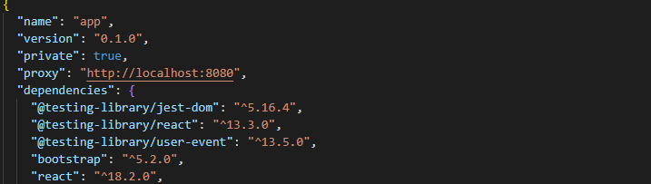

# Go-React-Blog

## Used Dependencies
- React
- Go
- Postgresql (go-pg)
- Gin Service
- GoDotEnv
- Zerolog
- Air(Live Host Reloading For Go)

## Install & run

### Front-end

First of all, you need to add this proxy into package.json file.

```bash
"proxy": "http://localhost:8080"
```
[]

```bash
cd/app
```

```bash
npm install
```

```bash
npm start
```

visit http://localhost:3000

### Back-end

- setup .env file
```bash
HOST=0.0.0.0
PORT=8080
DB_HOST=localhost
DB_PORT=5432
DB_NAME=xxx
DB_USER=xxxx
DB_PASSWORD=xxxxx
JWT_SECRET=xxxxxxxx
```

- migrate database
```bash
cd/migrations
go run . init
go run . up
```

- run backend
```bash
go run main.go
```

For the hot reload
```bash
air init
air server --port 8080
```

